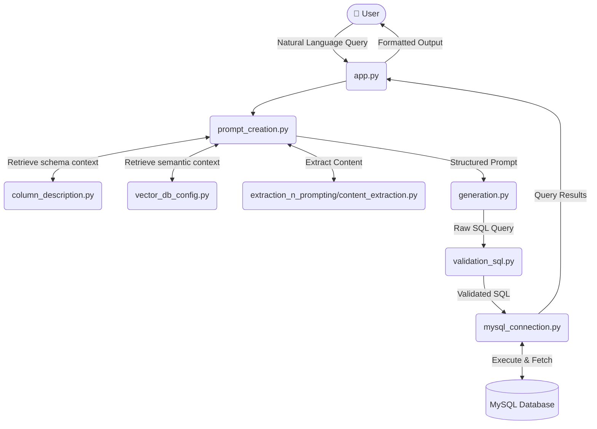

# Project Setup Guide

Follow the steps below to set up and run the project successfully.

## 🚀 Setup Instructions

1. **Create a Virtual Environment**

   ```bash
   python -m venv [ENV_NAME]
   ```

2. **Bypass Script Execution Policy (If Required)**  
   Some systems (especially Windows) block script execution by default.  
   To temporarily bypass this restriction, run:

   ```powershell
   Set-ExecutionPolicy -Scope Process -ExecutionPolicy Bypass
   ```

3. **Activate the Virtual Environment**  
   Activate the environment so that all packages install inside it:

   ```bash
   .\[ENV_NAME]\Scripts\activate
   ```

4. **Install Required Packages**  
   Install all dependencies listed in `requirements.txt`:

   ```bash
   pip install -r requirements.txt
   ```

5. **Run the Application**

   ```bash
   streamlit run app.py
   ```

---

✅ Your application should now be running successfully!


# Project Description

Here is a comprehensive `README.md` file based on the directory structure provided in the image. 

Since standard Markdown doesn't support embedding direct image files that don't exist yet, I have included a **Mermaid.js flowchart**. Mermaid is widely supported by GitHub, GitLab, and most modern Markdown viewers to render interactive architecture diagrams directly from text.

***

```markdown
# QuickQuery

QuickQuery is an AI-powered data extraction and querying pipeline designed to translate natural language into validated SQL queries. It integrates vector databases for semantic context retrieval, automated prompt engineering, and secure database connections to ingest, generate, and validate data queries seamlessly.

## 📂 Project Directory Layout

```text
QUICKQUERY/
│
├── __pycache__/                 # Compiled Python bytecode files
├── data_ingestion/              # Handles database connectivity and schema metadata
│   ├── column_description.py    # Fetches or stores descriptions/metadata of DB columns
│   └── mysql_connection.py      # Manages the secure connection to the MySQL database
│
├── extraction/                  # Base data or context extraction modules
│   └── content_extraction.py    # Logic for extracting specific content or context from sources
│
├── extraction_n_prompting/      # Core LLM prompt building and context retrieval
│   ├── content_extraction.py    # Extracts relevant context required for the specific query
│   └── prompt_creation.py       # Combines user input and context to engineer the LLM prompt
│
├── generation/                  # LLM integration and query validation
│   ├── generation.py            # Interfaces with the LLM to generate the SQL query
│   └── validation_sql.py        # Validates the generated SQL syntax and ensures execution safety
│
├── quickquery/                  # Core application package or internal modules folder
│
├── setup/                       # Configuration and environment setup
│   ├── .env                     # Stores sensitive environment variables (API keys, DB credentials)
│   └── global_veriables.py      # Stores global configuration constants used across the app
│
├── vector_store/                # Vector database configuration for semantic search (RAG)
│   └── vector_db_config.py      # Configuration for connecting and querying the Vector DB
│
├── app.py                       # Main application entry point (e.g., Streamlit, FastAPI, Flask)
└── requirements.txt             # List of Python dependencies required to run the project
```

## 🧩 Module Breakdown

### 1. Root Files
*   **`app.py`**: The main driver script of the project. It handles user inputs and orchestrates the flow between data ingestion, prompting, generation, and displaying the final results.
*   **`requirements.txt`**: Contains all necessary external libraries (like `langchain`, `pymysql`, `openai`, etc.) to run the project.

### 2. `data_ingestion/`
Responsible for interacting directly with your SQL database.
*   **`mysql_connection.py`**: Establishes the connection pool to the MySQL database.
*   **`column_description.py`**: Pulls schema details and column descriptions, which provides the LLM with an understanding of your database structure.

### 3. `vector_store/`
*   **`vector_db_config.py`**: Manages connection and retrieval settings for your vector database. This is used to store and quickly retrieve database schema embeddings or past successful queries to give the LLM better context.

### 4. `extraction_n_prompting/`
This is where the RAG (Retrieval-Augmented Generation) pipeline lives.
*   **`content_extraction.py`**: Pulls the most relevant context from the vector store or document embeddings.
*   **`prompt_creation.py`**: Assembles the system prompt, user query, database schema context, and few-shot examples into a strict prompt ready for the LLM.

### 5. `generation/`
*   **`generation.py`**: Sends the crafted prompt to the Large Language Model (LLM) and receives the raw generated SQL.
*   **`validation_sql.py`**: Parses the LLM's response, checks for SQL syntax errors, and optionally enforces read-only access (e.g., blocking `DROP` or `DELETE` statements) before execution.

### 6. `setup/`
*   **`global_veriables.py`**: A central configuration file holding constants like database names, API endpoints, or model parameters.
*   **`.env`**: Holds sensitive variables locally. *(Note: Ensure this is added to your `.gitignore` file).*

---

## ⚙️ Architecture & Execution Flow

*Note: This diagram uses Mermaid.js. If you view this README on GitHub, GitLab, or an IDE with a Markdown previewer, it will automatically render as a flowchart.*


```

*(Note based on the sources: The spelling `global_veriables.py` reflects the exact spelling as seen in your directory tree.)* 

Let me know if you would like me to generate a script to create this exact folder structure on your local machine!
